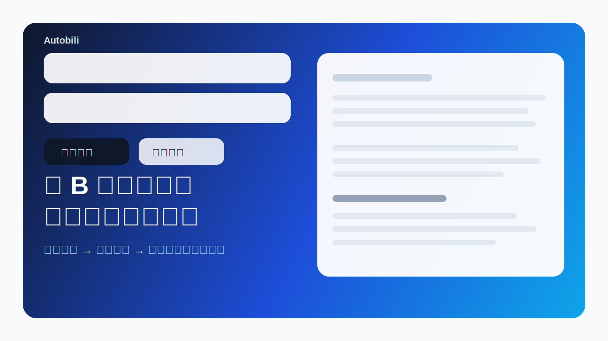
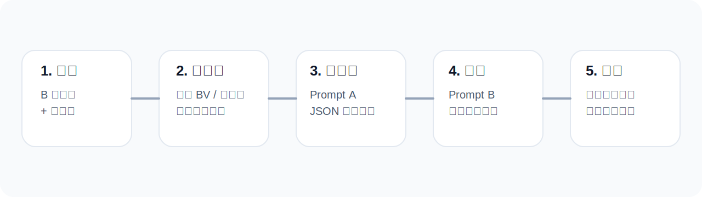
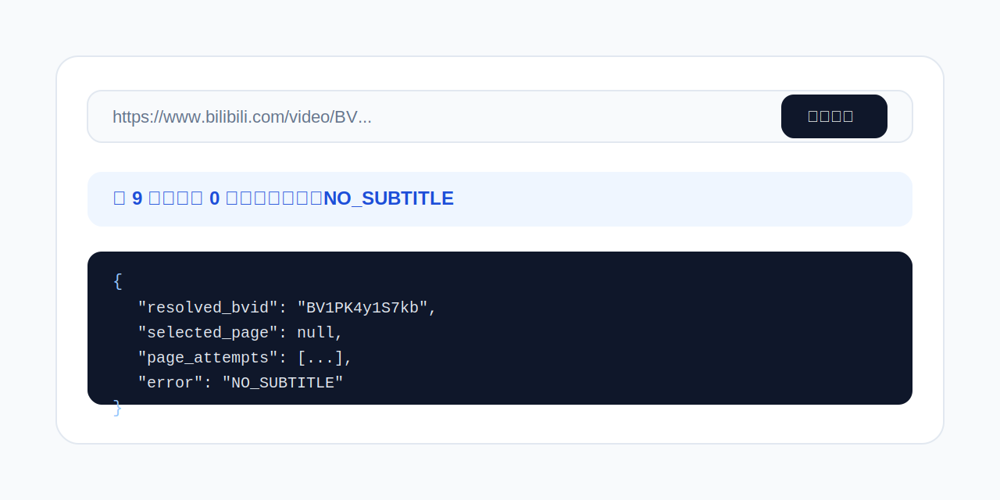

# Autobili

把一个 B 站视频的创作结构，迁移成你自己的新话题口播稿。

这是一个基于 Next.js 14、OpenAI SDK 和 TailwindCSS 的极简 Web 应用。用户输入一个 B 站视频链接和一个新话题后，系统会先抓取原视频字幕，再解构原视频的钩子、段落结构、节奏和可复用素材，最后流式生成一份长度对齐、结构复用、信息密度更高的新脚本。



## 为什么做这个

- 不是简单“洗稿”，而是先解构，再迁移
- 不是只看第一页字幕，而是会尝试多分页视频的不同 `cid`
- 不是黑盒报错，而是先用字幕调试把问题暴露清楚

## 核心流程



1. 输入 B 站链接和新话题
2. 解析 BV 号，探测视频分页和字幕
3. 用 Prompt A 做结构化解构
4. 根据原视频字数和结构比例生成 Prompt B
5. 流式返回新脚本并在前端即时渲染

## 安装运行

```bash
pnpm install
pnpm dev
```

启动后访问 `http://localhost:3000`。

## 环境变量

复制 `.env.local.example` 为 `.env.local`，并填入：

```bash
OPENAI_API_KEY=sk-xxx
```

没有配置 `OPENAI_API_KEY` 时，首页和字幕调试接口仍然可以使用；只是正式生成脚本会失败。

## 项目截图

### 首页与字幕调试



## 当前功能

- 首页输入 B 站链接和新话题，流式生成新脚本
- 自动解析常见 B 站输入形式：完整链接、带参数链接、直接输入 BV 号
- 自动尝试多分页视频的不同 `cid`，不是只盯第一页
- 首页内置“检查字幕”按钮，可直接查看字幕调试摘要和原始 JSON
- 提供独立调试接口，方便批量试 BV 号

## 技术栈

- Next.js 14 App Router
- TypeScript
- TailwindCSS
- OpenAI SDK
- pnpm
- 部署目标：Vercel

## 字幕调试

### 首页调试

在首页填写视频链接后，点击“检查字幕”，页面会显示：

- 可读摘要：总页数、命中字幕页数、当前选中页、当前状态
- 原始调试 JSON：包括 `subtitle_list`、`page_attempts`、`resolved_bvid`、`final_url` 等字段

### 调试接口

你也可以直接请求：

```bash
GET /api/debug/subtitle?input=<视频链接或BV号>
```

或：

```bash
GET /api/debug/subtitle?bvid=<BV号>
```

返回内容包括：

- `input`
- `resolved_bvid`
- `resolve_source`
- `final_url`
- `title`
- `cid`
- `selected_page`
- `selected_part`
- `subtitle_list`
- `page_attempts`
- `first_subtitle_url`
- `transcript_preview`
- `transcript_length`
- `error`

## 项目结构

```text
app/
  api/
    debug/subtitle/route.ts
    generate/route.ts
  debug-panel.tsx
  globals.css
  layout.tsx
  page.tsx
docs/
  assets/
    debug.svg
    flow.svg
    hero.svg
lib/
  bilibili.ts
  openai.ts
  prompts.ts
README.md
```

## 本地开发建议

1. 先不急着配 OpenAI key，先用“检查字幕”确认 BV 号是否真的有官方字幕
2. 多 P 视频优先看 `page_attempts`，确认是整条视频没字幕，还是只有某一页没有
3. 确认字幕链路通了，再进入正式生成联调
4. 如果要部署到 Vercel，只需要补 `OPENAI_API_KEY`

## 已知限制

目前只支持有官方字幕的 B 站视频。
